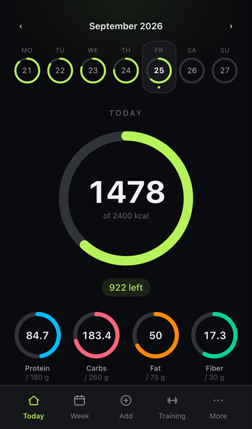
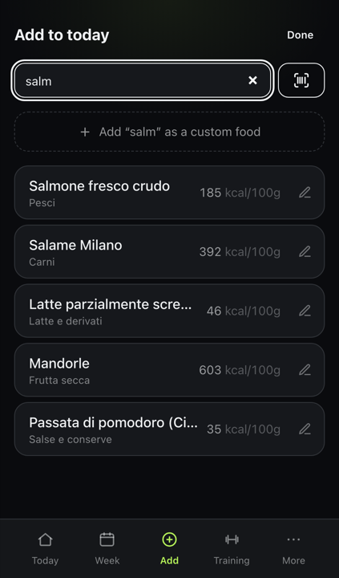
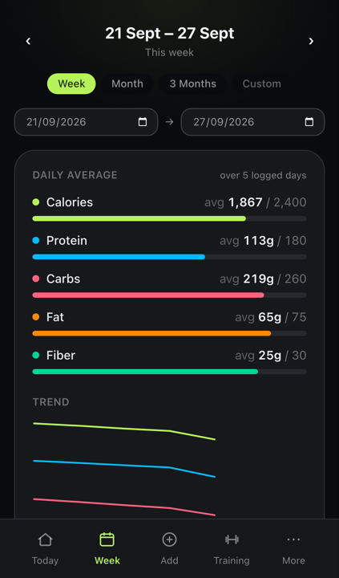
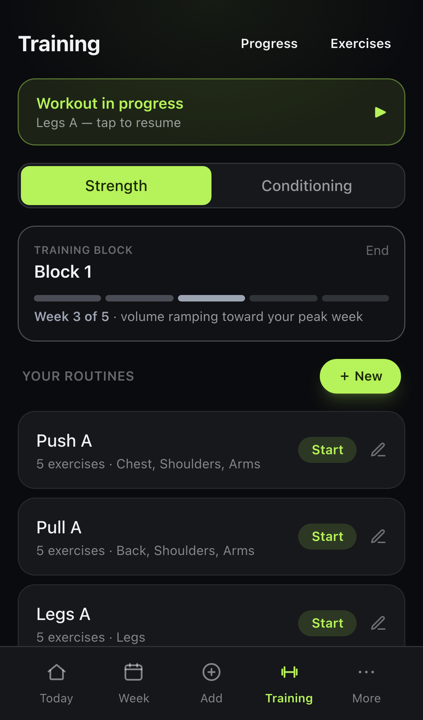
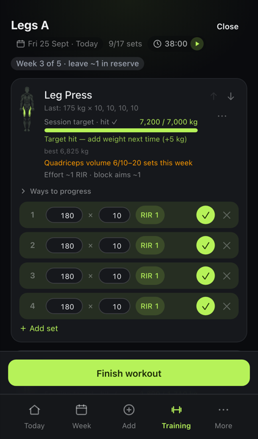
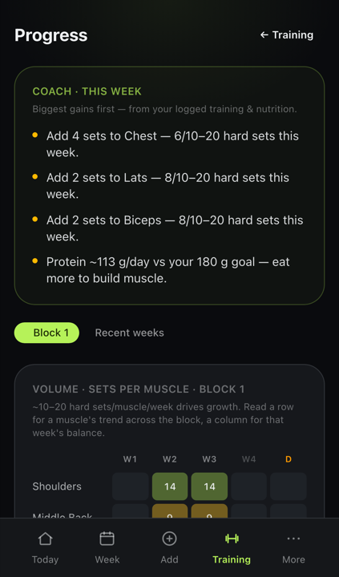

# Pasto

Nutrition and strength-training tracker built on the official Italian food tables (CREA).
It is a local-first PWA: it installs on the phone, works offline, and your data stays on your device.

**Live app:** <https://gray-man-69.github.io/pasto>

<p>
  
  
  
</p>
<p>
  
  
  
</p>

## What it does

- Log food per meal against daily calorie, macro, fibre and water goals. Goals can be set by hand or from the built-in TDEE calculator.
- Food database from CREA, the official Italian food composition tables. Packaged products via barcode scan (Open Food Facts) or by photographing the nutrition label (OCR).
- Saved meals, custom foods, day history, week / month / custom-range trends.
- Body weight trend with calorie and protein averages over the same period, plus progress photos.
- Strength training: routines, per-set weight / reps / RIR logging, mesocycle blocks that ramp weekly volume and deload, an exercise library with a muscle map, HIIT and core timers.
- Water reminders by web push.
- Optional sign-in to sync across devices (Firebase). Daily steps and active energy from Apple Health via an iOS Shortcut.
- English and Italian interface.

## How it is built

- **App:** Next.js 16 static export, React 19, TypeScript, Tailwind 4 + DaisyUI, Dexie (IndexedDB), Fuse.js search, ZXing for barcodes, tesseract.js plus a small Cloudflare Worker for label OCR.
- **Data:** a Python script turns the CREA CSV into the bundled `foods.json`. The app never calls a nutrition API at runtime except for barcode lookups.
- **Automation:** GitHub Actions deploy to GitHub Pages on every push to `main`, run the hourly water-reminder sender, and run Claude Code on any issue or comment that mentions `@claude`: it reads the repo guide, makes the change on a branch and opens a pull request for review.
- **Process:** the backlog is GitHub Issues; every change lands through a pull request.

```
pipeline/    Python: CREA CSV  ->  app/public/foods.json
app/         Next.js PWA
worker/      Cloudflare Worker: label OCR proxy and Apple Health ingest
reminders/   web-push sender for water reminders (GitHub Actions cron)
```

## Run it locally

```bash
# 1. Build the food database (writes app/public/foods.json)
cd pipeline
python3 build_foods.py

# 2. Start the app
cd ../app
npm install
npm run dev          # http://localhost:3000
npm run build        # production static export to out/
npm test             # macro math unit tests
```

## Food data

`app/public/foods.json` is generated. Edit the source CSV and re-run the pipeline:

```bash
cd pipeline
python3 build_foods.py                          # uses data/crea_bootstrap.csv
python3 build_foods.py --input crea_full.csv    # full CREA export
```

The bundled `data/crea_bootstrap.csv` is a curated seed set of 82 common Italian foods.
To use the full CREA tables (about 1,000 foods), download the export, map its columns in
`COLUMN_ALIASES` inside `build_foods.py`, and run with `--input`. Verify values against
the official portal before trusting any export.

## Data sources and attribution

- **CREA, Tabelle di Composizione degli Alimenti** (ex-INRAN), the official Italian food composition tables. Free to use with attribution. <https://www.alimentinutrizione.it>
- **Open Food Facts** (barcode lookups), open data under ODbL. <https://world.openfoodfacts.org>

## License

MIT
